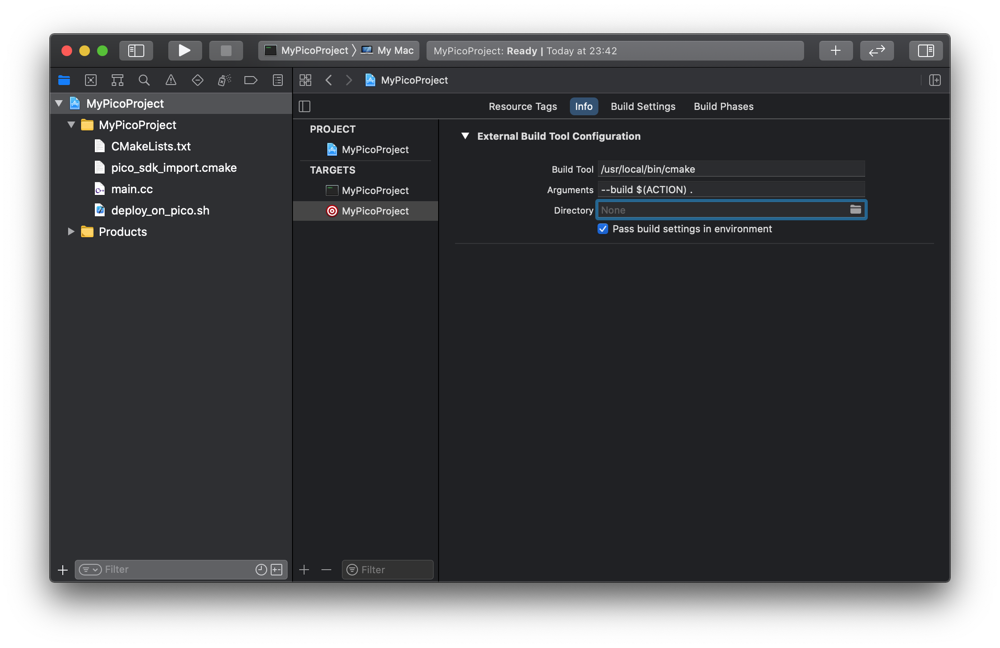
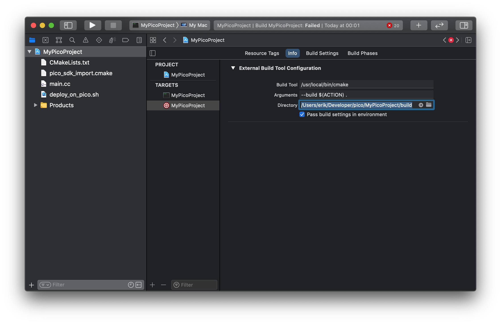

# Raspberry Pi Pico Xcode Template
An Xcode template for creating new Raspberry Pi Pico projects.


## Introduction
As a Apple ecosphere developer in general and macOS developer specifically, I wanted to be able to develop C/C++ code for the Raspberry Pi Pico using my favorite IDE, Xcode. The official toolchain and other options—Visual Studio Code et al—were not macOS native and therefore not appealing to me.

The Xcode template structure is not a public Apple API and has many limitations of what can be done with it. The templates are controlled by a XML serialized property list (`TemplateInfo.plist`) and the 

## Goals
The main goal of this work is to make the experience of developing C/C++ code for the Raspberry Pi Pico less painful on macOS.

I want: 
* A low barrier to start a new project.
* To be able to build C/C++ pico code in Xcode.
* To be able to navigate C/C++ code in Xcode.
* Xcode code completion working properly.

## Requirements
* Obviously [Xcode](https://developer.apple.com/xcode/) with the additional command line tools installed.
* The [Raspberry Pi Pico C/C++ SDK](https://github.com/raspberrypi/pico-sdk).
* The `PICO_SDK_PATH` environment variable set to point to the Pico SDK.
* The optional deploy script uses Raspberry Pi's [picotool](https://github.com/raspberrypi/picotool). `picotool` in turn, depends on `libusb-1.0`, which can be installed via Homebrew. Then `picotool` needs to be cloned, compiled and installed:
```
    brew install libusb
    cd `dirname $PICO_SDK_PATH`
    git clone https://github.com/raspberrypi/picotool.git
    cd picotool
    mkdir build
    cmake ..
    make install
````

* A directory structure where the Pico SDK and other possible dependencies, are placed on the same level as the new pico project:

```
    ...
     ├─ pico-sdk
     ├─ pico-examples
     ├─ pimoroni-pico
     ├─ other pico libs
     └─ your project
```

## Installation
1. Make sure the `PICO_SDK_PATH` environment variable is set and then:
```
    cd `dirname $PICO_SDK_PATH`
```
2. Clone the Pico-Xcode-template repository:
```
    git clone https://github.com/erikt/Pico-Xcode-template.git
```
3. Run the install script:
```
    Pico-Xcode-template/install_template.sh
```

## Usage
Ideally, using the template would just involve creating a new Xcode project. At the moment, a few additional manual steps are also required.

1. Create a new project in Xcode (⇧ + ⌘ + N).

2. Pick the Raspberry Pi Pico project from the `other` tab.<br>


3. Name the project.<br>


4. Create the project in the same directory where the Pico SDK is.

5. We now need to do create the build directory and let CMake generate the initial Makefile:
```
    cd `dirname $PICO_SDK_PATH`/MyPicoProject
    mkdir build
    cd build
    cmake ..
```

6. Back in Xcode:
- Select the project in the Project Navigator
- Select the external build target.
- Select the Info tab. 
- Set the build tool directory to the `build` directory in your project directory.<br>
<br>


7. Xcode has automatically created a group we don't need (named the same as our project). First select all the files in the Project Navigator and drag them up one level to right below the top project node. Delete the empty unneccessary group.


8. 

## Future improvements
Here are a few things that would be great if it was possible to do in the future:
* Remove all manual usage steps.
* Stop Xcode from creating groups within the project.
* Deploying and running from within Xcode.
* Using LLDB and Xcode to debug running code.

At the moment, I have no idea if any of these are even possible. I greatly appreciate all feedback and suggestions for improvements. You most probably know much more than me about CMake, C/C++ and the Xcode build system ... 

## Author
Copyright &copy; 2022 Erik Tjernlund <erik@tjernlund.net>
